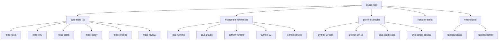

# mise-workflows

이 plugin은 `mise.toml` 기반 프로젝트의 `[tools]`, `[env]`, `[tasks]`, policy, profile, review 흐름을 Codex에서 일관되게 다루기 위한 로컬 plugin이다.

## 포함 내용

- `skills/`
  - core skills only: `mise-tools`, `mise-env`, `mise-tasks`, `mise-policy`, `mise-profiles`, `mise-review`
- `references/`
  - 공통 canonical reference
  - policy, profile, env/task patterns, ecosystem-specific guidance, example `mise.toml`
- `scripts/validate_mise_toml.py`
  - JSON / text 출력을 지원하는 `mise-review` validator
- `targets/`
  - `claude`, `gemini`용 하네스별 패키징 레이어
  - Codex는 별도 `targets/codex` 패키지 대신 plugin root 자체를 정식 진입점으로 사용한다
  - `targets/claude`, `targets/gemini`는 현재 host-specific manifest scaffold를 담는다

## 설계 원칙

- 공통 개념은 plugin 루트 `references/`에 둔다.
- skill 내부 `references/`는 실행 체크리스트와 특화 문서만 둔다.
- profile은 라우터이고, 언어/build/package manager 규칙 저장소가 아니다.
- tracked `mise.toml`에는 selector를, exact resolution은 `mise.lock`에 둔다.
- 버전 후보는 `mise ls-remote` 또는 `mise latest`로 실제 해석 가능성을 확인한다.

## 구조 도식



## 대표 profile 예시

아래 목록은 이 plugin이 자주 다루는 조합을 문서화한 starter profile 예시다.

- 이 목록은 `mise-workflows`의 전체 지원 범위를 제한하지 않는다.
- named profile이 없더라도 core skill과 ecosystem reference 조합으로 다른 `mise` 기반 저장소를 다룰 수 있다.
- 반복적으로 등장하는 조합은 이후 새로운 profile로 승격할 수 있다.
- 현재 validator의 profile-specific rule은 일부 대표 profile 위주로 내장되어 있다.

- `python-uv-app`
- `python-uv-lib`
- `java-gradle-app`
- `java-spring-service`

profile 이름과 조합 정보는 다음 문서를 본다.

- [references/profile-catalog.md](./references/profile-catalog.md)

profile 선택 신호는 다음 문서를 본다.

- [references/profile-composition.md](./references/profile-composition.md)

대표 starter `mise.toml` 예제는 다음 문서를 본다.

- [references/profile-examples.md](./references/profile-examples.md)

## 검증

```bash
# Run from plugin root.
python3 "$HOME/.codex/skills/.system/skill-creator/scripts/quick_validate.py" \
  ./skills/mise-tools

python3 "$HOME/.codex/skills/.system/plugin-creator/scripts/validate_plugin.py" \
  .

python3 ./scripts/validate_mise_toml.py --format text <target-repo>
```
